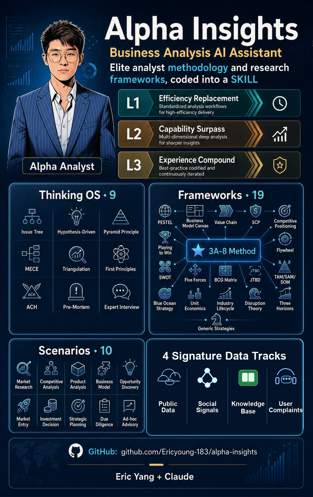

# Alpha Insights-BizAdvisor

> **Elite analyst methodology and frameworks, coded into a SKILL**

[](https://opensource.org/licenses/MIT)
[](https://claude.ai/code)



---

## What is Alpha Insights?

Alpha Insights is a professional business analysis AI assistant for [Claude Code](https://claude.ai/code). It produces in-depth, decision-ready research reports — the kind a senior analyst would deliver.

**Why Alpha Insights?**

| Typical AI Analysis | Alpha Insights |
|---------------------|----------------|
| Generic, surface-level | **Framework-driven** — 19 professional analysis frameworks |
| No source tracing | **Evidence chain** — every conclusion tagged with source & confidence |
| Single data source | **Multi-track parallel** search with triangulation |
| One-shot output | **Interactive iteration** — progressively deeper insights |
| Skips steps silently | **Harness-enforced** — script-based gates, not just prompt instructions |

### See It in Action

> **[View Demo Report (HTML)](https://ericyoung-183.github.io/alpha-insights/assets/demo-report.html)** — A competitive analysis of China's EV charging industry.
> Full report with executive summary, Porter's Five Forces, competitive positioning charts, evidence-graded findings, and strategic recommendations with ROI estimates — generated in one session.

**Core Value**:
- **L1 Efficiency Replace**: Save 60%+ desk research time
- **L2 Capability Surpass**: Methodology-driven output on par with senior analysts
- **L3 Experience Compound**: Every research compounds into knowledge assets

### V2: Harness Engineering

Prompt instructions are probabilistic — AI tends to skip steps as context fills up. V2 invests in the **execution environment** instead of just prompts:

- **State machine** — tracks research stage, tier, loaded frameworks, interview status
- **6-stage gate validators** — auto-check deliverables before advancing (PASS/FAIL/WARN)
- **Hook automation** — HTML write guard, context budget alerts, auto gate checks
- **Context budget** — monitors token usage, auto-compresses completed stages when needed
- **Quality dashboard** — one-screen overview of all quality metrics before report generation

---

## Features

### Thinking OS — 9 Methodologies

MECE | Issue Tree | Hypothesis-Driven | Pyramid Principle | Triangulation | Pre-Mortem | First Principles | ACH (Analysis of Competing Hypotheses) | Expert Interview

### Research Frameworks — 19

**Original**:
- ★ 3A-8 Steps Strategy — End-to-end methodology from industry landscape to strategic convergence

**Classic**:
- Strategy: Porter's Five Forces, Value Chain, SWOT, PESTEL, BCG Matrix
- Business Model: Business Model Canvas, Platform Canvas, Unit Economics
- Market: TAM/SAM/SOM, Competitive Positioning, Industry Lifecycle
- Innovation: Disruption Theory, Blue Ocean Strategy, Jobs-to-be-Done
- Planning: Playing to Win, Three Horizons, Flywheel, SCP

### 10 Research Scenarios

| Scenario | Coverage |
|----------|----------|
| 🎯 Industry Research | Market size, growth drivers, value chain, key players |
| ⚔️ Competitive Analysis | Landscape, rival strategies, differentiation, response |
| 📱 Product Analysis | Features, UX, comparison, positioning, iteration |
| 💼 Business Model | Model teardown, revenue logic, unit economics |
| 🔍 Opportunity Discovery | Value gaps, unmet needs, emerging trends |
| 🌍 Market Entry | New market feasibility, entry path, go-to-market |
| 💰 Investment Decision | Due diligence, valuation, investment thesis |
| 📈 Strategic Planning | Annual/3-year plan, goals, roadmap |
| 🔒 Due Diligence | Risk review, compliance, background check |
| ❓ Ad-hoc Advisory | Policy impact, trend analysis, event assessment |

---

## Quick Start

### Install

**via Git**:

```bash
git clone https://github.com/Ericyoung-183/alpha-insights.git
cp -r alpha-insights ~/.claude/Skills/
```

### Usage

In Claude Code, simply ask a business analysis question:

```
User: Analyze the competitive landscape of the EV charging industry in China
```

Alpha Insights will automatically:
1. Identify the research scenario (Competitive Analysis)
2. Select matching frameworks (Porter's Five Forces + Competitive Positioning)
3. Run multi-track parallel data search
4. Generate a structured HTML research report

---

## Data Source Configuration

### 🟢 Works Out of the Box

| Source | Description | How |
|--------|------------|-----|
| **Public channels** | Industry reports, analyst research, filings, news, policy docs | Search engine + web scraping |
| **Expert interviews** | Custom interview guides, recording templates, analysis guidance | Built-in methodology |
| **Xiaohongshu (RedNote)** | Consumer sentiment, product feedback, trend signals | Built-in scripts + public API key. To use your own key, create `~/.alpha_insights.json` with `{"tikHubApiKey": "YOUR_KEY"}` |

### 🟡 Optional Extensions

| Source | Description | Required Setup |
|--------|------------|----------------|
| **Knowledge base** | Historical reports, industry notes | Notion MCP / Knowledge Base MCP |
| **Internal data** | Business metrics, user behavior | ODPS MCP / Database MCP |

> Unconfigured data sources are automatically skipped — core functionality is not affected.

#### Internal Data Setup

SQL examples in SKILL files use `{project}.{table_name}` placeholders. Once you configure a database MCP tool, the AI will automatically discover available tables via the table search capability — no manual replacement needed.

---

## Directory Structure

```
alpha-insights/
├── SKILL.md              # Main file (workflow orchestration, V2.0)
├── CHANGELOG.md          # Version history
├── README.md             # This file
├── frameworks/           # 19 analysis frameworks
│   ├── _index.md         # Framework routing table
│   ├── 3a_8steps_strategy.md
│   ├── porters_five_forces.md
│   └── ...
├── methodology/          # 9 methodologies
│   ├── mece.md
│   ├── hypothesis_driven.md
│   └── ...
├── resources/            # Execution resources (Stage 3-5 input)
│   ├── data_sources.md
│   ├── research_engine.md
│   ├── judgment_rules.md
│   ├── quality_review.md # Independent Quality Review (IQR)
│   └── anti_patterns.md
├── references/           # Report standards (Stage 6-7 output)
│   ├── report_standards.md
│   └── report_template.html
└── scripts/
    ├── report_helper.py  # ReportBuilder for HTML generation
    ├── harness/          # V2 Harness Engineering
    │   ├── state_manager.py
    │   ├── stage_gate.py
    │   ├── context_budget.py
    │   ├── compress_stage.py
    │   ├── dashboard.py
    │   ├── resume_check.py
    │   ├── validators/   # 6-stage gate validators
    │   └── hooks/        # 4 automation hooks
    └── xhs/              # Xiaohongshu (RedNote) scripts
```

---

## Sample Output

Reports generated by Alpha Insights follow this structure:

```
📊 Research Report
├── Executive Summary (1 page)
├── Key Findings (3-5)
├── Detailed Analysis
│   ├── Industry Overview
│   ├── Competitive Landscape
│   ├── Key Player Profiles
│   └── Opportunities & Risks
├── Strategic Recommendations
└── Appendix
    ├── Source List (A/B/C/D graded)
    └── Evidence Base
```

**Data Quality Grading**:

| Grade | Standard | Confidence |
|-------|----------|------------|
| A | 3+ independent sources cross-validated | ✅ High |
| B | 2 sources cross-validated | ✅ Reliable |
| C | Single authoritative source | ⚠️ Suggest further validation |
| D | Single source, questionable reliability | ❌ Reference only |

---

## Contributing

Contributions welcome!

1. Fork the repo
2. Create a feature branch (`git checkout -b feature/amazing-feature`)
3. Commit your changes (`git commit -m 'Add amazing feature'`)
4. Push to the branch (`git push origin feature/amazing-feature`)
5. Open a Pull Request

**Areas to contribute**:
- New analysis frameworks
- Methodology improvements
- Additional data source adapters
- Test cases

---

## License

MIT License

---

## Acknowledgments

**Classic frameworks by**:
- Michael Porter (Five Forces, Value Chain)
- Boston Consulting Group (BCG Matrix)
- McKinsey & Company (Three Horizons, Hypothesis-Driven)
- Clayton Christensen (Disruption Theory, JTBD)
- Jim Collins (Flywheel)
- Alexander Osterwalder (Business Model Canvas)

---

**Author**: Eric Yang + Claude
**Original framework**: ★ 3A-8 Steps Strategy
**Core philosophy**: Encode methodology into code
